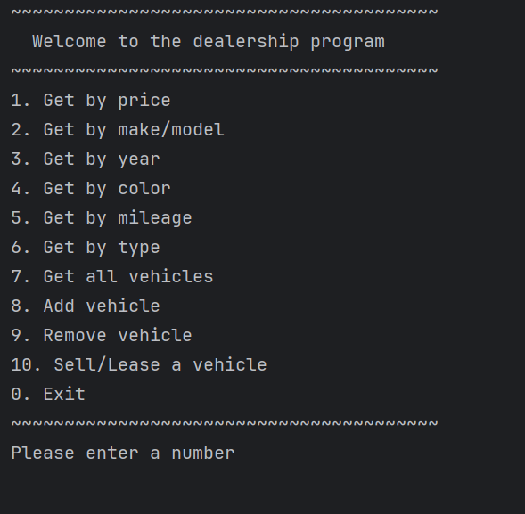

_______________________
# Car Dealership
_______________________
## This is a updated version of the Car Dealership console application. In this version, users are allowed to sell or lease a vehicle. The program calculates all of the costs and updates the inventory and contract. ________________________
# *Features*

- Error Handling
- CSV File Handling
- Console IO
- Filter Vehicles by Categories
- List All Vehicles
- Add Vehicle
- Remove Vehicle
- Sell a Vehicle
- Lease a Vehicle
___________________________________
# *Interesting Code*

     @Override
    public double getTotalPrice() {
        double vehiclePrice = getVehicleSold().getPrice();
        double salesTotalPrice = vehiclePrice+getSalesTaxAmount()+getRecordingFee()+getProcessingFee();

        return salesTotalPrice;
    }

This is the most interesting code in this program to me. Using one of the pillar of OOP, Abstraction, allowed us to use the same method but implement it in different ways. This helped in scalability and keep the code DRY.
_______________________________________________
# Screenshots
### Main Menu

### Sell Menu

### Lease Menu
